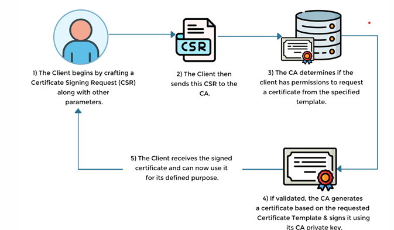
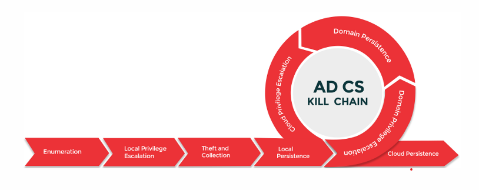
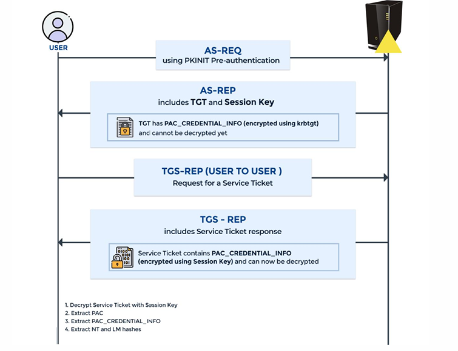

# Notes

1. What is ADCS?
    - Active Directory Certificate Services is a Windows Server role for issuing and managing PKI used for secure communication and authentication protocols.

2. What is PKI authentication?
    - This is just another alternate to password authentication. It employs asymmetric encryption.

3. Interesting Certificate Attributes:
    - **Issuer**: Issuer for the certificate, the CA's
    - **Validity period**: Start and end date of the certificate
    - **Subject**: The entity to which the certificate is issued
    - **Subject Alternative Name**: Alternate name the subject may use
    - **Extended Key Usage**: What's the purpose of the certificate

4. Certificates EKU and OIDs:
    - **Server Authentication (1.3.6.1.5.5.7.3.1)**: Intended for server authentication, allowing the certificate to be used for authenticating servers in SSL/TLS communication.
    - **Client Authentication (1.3.6.1.5.5.7.3.2)**: Allows the certificate to be used for verifying the identity of clients accessing secure services.
    - **Code Signing (1.3.6.1.5.5.7.3.3)**: Used for signing executable code, scripts, and macros. It verifies the integrity and authenticity of software or code by ensuring that it hasn't been tampered with since it was signed.
    - **Secure Email (1.3.6.1.5.5.7.3.4)**: Used for digitally signing and encrypting email messages, ensuring the confidentiality and integrity of email communications.
    - **Encrypting File System (1.3.6.1.4.1.311.10.3.4)**: Allows for the encryption and decryption of files and folders on NTFS volumes.

5. Certificate Signing Request:
    

    Note: Information about the certificate service roles [here](https://learn.microsoft.com/en-us/windows-server/identity/ad-cs/certification-authority-role)

6. AD CS Kill Chain:
    

    | Technique ID | Description | Attack |
    |--------------|-------------|--------|
    | ESC1 | Enrollee can request cert for ANY user (CT_FLAG_ENROLLEE_SUPPLIES_SUBJECT + Client Authentication/Smart Card Logon EKU) | Domain Privilege Escalation |
    | ESC2 | Enrollee can request cert for ANY user (CT_FLAG_ENROLLEE_SUPPLIES_SUBJECT + AnyPurpose EKU or no EKU) | Domain Privilege Escalation |
    | ESC3 | Request an enrollment agent certificate (Application Policy - Certificate Request Agent) and use it to request a cert on behalf of ANY user (Certificate Request Agent EKU) | Domain Privilege Escalation |
    | ESC4 | Vulnerable ACLs (GenericWrite) over AD CS Certificate Templates | Domain Privilege Escalation |
    | ESC5 | Poor Access Control (GenericWrite) on CA Server Computer Object | Domain Privilege Escalation |
    | ESC6 (Fixed) | Vulnerable EDITF_ATTRIBUTESUBJECTALTNAME2 setting on CA allowing requesting certs for ANY user | Domain Privilege Escalation |
    | ESC7 | Vulnerable Certificate Authority Access Control Roles (ManageCA and ManageCertificate) | Domain Privilege Escalation |
    | ESC7 Case 1 | Approve failed certificate requests for ANY user using ESC7 misconfiguration | Domain Privilege Escalation |
    | ESC7 Case 2 | Abuse CRL (Certificate Revocation List) Distribution Points and use them with ManageCA rights to deploy webshells to CA server | Domain Privilege Escalation |
    | ESC8 | NTLM Relay ANY domain computer to AD CS HTTP Endpoint | Domain Privilege Escalation |
    | ESC9 (fixed) | If CT_FLAG_NO_SECURITY_EXTENSION (0x80000) is set on a specific template the szOID_NTDS_CA_SECURITY_EXT security extension will not be embedded | Domain Privilege Escalation |
    | ESC10 case1 (fixed) | Weak Certificate Mappings – StrongCertificateBindingEnforcement set to 0 in registry | Domain Privilege Escalation |
    | ESC10 case2 (fixed) | Weak Certificate Mappings - CertificateMappingMethods set to 4 in registry | Domain Privilege Escalation |
    | ESC11 | NTLM Relay ANY domain computer to AD CS ICertPassage Remote Protocol (ICPR) RPC Endpoints | Domain Privilege Escalation |
    | Certifried: CVE-2022–26923 (fixed) | Updating the dNSHostName property of a controller computer account to impersonate ANY target computer account | Domain Privilege Escalation |
    | CertPotato | Abuse virtual and network service accounts (authenticates as machine account in domain) to escalate privileges to local system | Local Privilege Escalation |
    | THEFT1 | Exporting certificates and their private keys using Window’s Crypto API | Theft and Collection |
    | THEFT2 | Extracting User certificates and private keys using DPAPI | Theft and Collection |
    | THEFT3 | Extracting Computer certificates and private keys using DPAPI | Theft and Collection |
    | THEFT4 | Theft of existing certificates on-disk | Theft and Collection |
    | THEFT5 | Using the Kerberos PKINIT protocol to retrieve a User/Computer account’s NTLM hash | Theft and Collection |
    | PERSIST1 | User account persistence using new certificate requests | Local Persistence |
    | PERSIST2 | Computer account persistence using new certificate requests | Local Persistence |
    | PERSIST3 | User/Computer Account persistence by certificate renewal before expiration | Local Persistence |
    | DPERSIST1 | Forge ANY domain certificate using stolen CA Root certificate and private keys | Domain Persistence |
    | DPERSIST2 | Forge ANY domain certificate using stolen external Trusted Root certificate and private keys (added root/intermediate/NTAuthCA certificates container) | Domain Persistence |
    | DPERSIST3 | Backdoor CA server using malicious misconfigurations like ESC4 that can later cause a domain escalation | Domain Persistence |
    | Trust abuse - Enterprise CA and Azure AD Certificate-Based Authentication | A compromised Certificate Authority trusted by an Azure AD tenant, enables forging certificates and impersonate any user in the target tenant. This results in privilege escalation to the tenant if the user has administrative roles assigned in the tenant and persistence as long as the certificate doesn’t expire. | Cloud Privilege Escalation and Persistence |
    | PREVENT1 | Treat CAs as Critical Tier0 Assets | Prevention |
    | PREVENT2 | Harden CA settings and configuration | Prevention |
    | PREVENT3 | Audit Published templates for misconfigurations | Prevention |
    | PREVENT4 | Harden Certificate Template Settings | Prevention |
    | PREVENT5 | Audit NTAuthCA certificates container for External insecure Trusted Root certificates and private keys | Prevention |
    | PREVENT6 | Secure Certificate Private Key Storage | Prevention |
    | PREVENT7 | Enforce Strict User Mappings (CBA Patch in Full Enforcement Mode) | Prevention |
    | PREVENT8 | Harden AD CS HTTP and ICPR Enrollment Endpoints | Prevention |
    | DETECT1 | Monitor User/Machine Certificate Enrollments | Detection |
    | DETECT2 | Monitor Certificate Authentication Events | Detection |
    | DETECT3 | Monitor Certificate Authority Backup Events | Detection |
    | DETECT4 | Monitor Certificate Template Modifications | Detection |
    | DETECT5 | Monitor Certificate Template Modifications | Detection |
    | DETECT6 | Detecting use of Honey Credentials | Detection |
    | DETECT7 | Miscellaneous Detective Techniques | Detection |

7. Some tools used:
    - **certi**: Impacket copy of Certify to abuse AD CS.
    - **ADCSKiller**: Automated discovery and exploitation of AD CS abuses.
    - **PKINITools**: Repo contains some utilities for playing with PKINIT and certificates.
    - **PoshAD CS**: Proof of concept on attack vectors against Active Directory by abusing AD CS.
    - **ForgeCert**: Forge certificates for any user using compromised CA certificate and private keys.
    - **pyForgeCert**: Python equivalent of ForgeCert.
    - **modifyCertTemplate**: Python equivalent with more manual granular control of ForgeCert.
    - **CarbonCopy**: Creates a spoofed certificate of any online website and signs an executable for AV evasion.
    - **KrbRelayUp**: A universal no-fix local privilege escalation in Windows domain environments where LDAP signing is not enforced (the default settings).

8. AV Bypass:
    - [SharpDPAPI](https://vscode.dev/github/abhisara01/Active-Directory-Certificate-Services-Attack-and-Defend/blob/main/AD%20CS%20-%20Notes.md#L93) and [Certifykit](https://github.com/Hagrid29/CertifyKit) can bypass defender with string manipulation or code.
    - [InvisibilityCloak](https://github.com/h4wkst3r/InvisibilityCloak) can be used to obfuscate the C# code to an encoded base64 or rot13 or reverse format to break static code detection.
    - [ConfuserEx](https://mkaring.github.io/ConfuserEx/) to binary obfuscate.

9. Check for Evasion:
    - [ThreatCheck](https://github.com/rasta-mouse/ThreatCheck) can be used to see if the binary can be detected.

10. Binary Delivery:
     - [Netloader](https://github.com/Flangvik/NetLoader) for delivery of binary into memory. NetLoader patches AMSI & ETW within the current process to bypass AV and ETW based telemetry solutions, when execution happens.

11. Powershell Logging Bypass:
     - [Invishell](https://github.com/OmerYa/Invisi-Shell) can be used to bypass PowerShell logging mechanism.

     "A common language runtime (CLR) profiler is a dynamic link library (DLL) that consists of functions that receive messages from, and send messages to, the CLR by using the profiling API. The profiler DLL is loaded by the CLR at run time."

12. Winrs for powershell remoting
     - To evade script blocking and transcripts we can use [winrs](https://github.com/bohops/WSMan-WinRM).

13. Certificate Management
     - [Certify](https://github.com/GhostPack/Certify) or [cerutil](https://learn.microsoft.com/en-us/windows-server/administration/windows-commands/certutil) can be used to import,export or request certificate using Crypto WINAPI.
     - WIndows Certificate manager can be used to get the certificates interactively

14. AD CS Abuse Techniques
     - Pass the Cert - a pre-authentication techique that uses certificate to obtain TGT. Client authentication EKU to be set for this PTC to work.
     - PKINIT - Public Key Cryptography for Initial Authentication - pre-authentication for Kerberos to request TGT
     - PTC with Schannel
     - UnPAC the Hash - [S4U2self](https://learn.microsoft.com/en-us/openspecs/windows_protocols/ms-sfu/02636893-7a1f-4357-af9a-b672e3e3de13) can be used to impersonate any user including DA.

     

15. CBA Patch
     - with CBA patch enabled without proper bypass even ESC1 exploitation attempt will fail with event ID 39. 
     Note: In Full Enforcement AD CS exploitation techniques break ESC6/9/20 but there are bypasses for ESC1/2/3.
     manually add sid to certificate : [link](https://elkement.art/2023/03/30/lord-of-the-sid-how-to-add-the-objectsid-attribute-to-a-certificate-manually/)


# AD CS - Enumeration

Commands to enumerate AD CS in the environment:

1. Look for AD CS containers using the AD Module:
    ```powershell
    Get-ADObject -Filter * -SearchBase 'CN=Certification Authorities,CN=Public Key Services,CN=Services,CN=Configuration,DC=cb,DC=corp'
    ls 'AD:\CN=Certification Authorities,CN=Public Key Services,CN=Services,CN=Configuration,DC=cb,DC=corp'
    ```

2. Based on ObjectClass:
    ```powershell
    Get-ADObject -LDAPFilter '(objectclass=certificationAuthority)' -SearchBase 'CN=Configuration,DC=cb,DC=corp' | fl *
    ```

3. Enumerate CA:
    ```powershell
    Certify.exe cas
    ```

4. Find Templates:
    ```powershell
    Certify.exe find
    ```

# Offensive Techniques

1. Local Privilege escalation - CertPotato
- CertPotato vulnerability primarily abuse virtual accounts to gain a machine account context.
- tgtdeleg trick to obtain useful TGT to request a certificate as machine account.
- NO ADMIN RIGHTS NEEDED TO REQUEST tgt FOR MACHING ACCOUNT.

